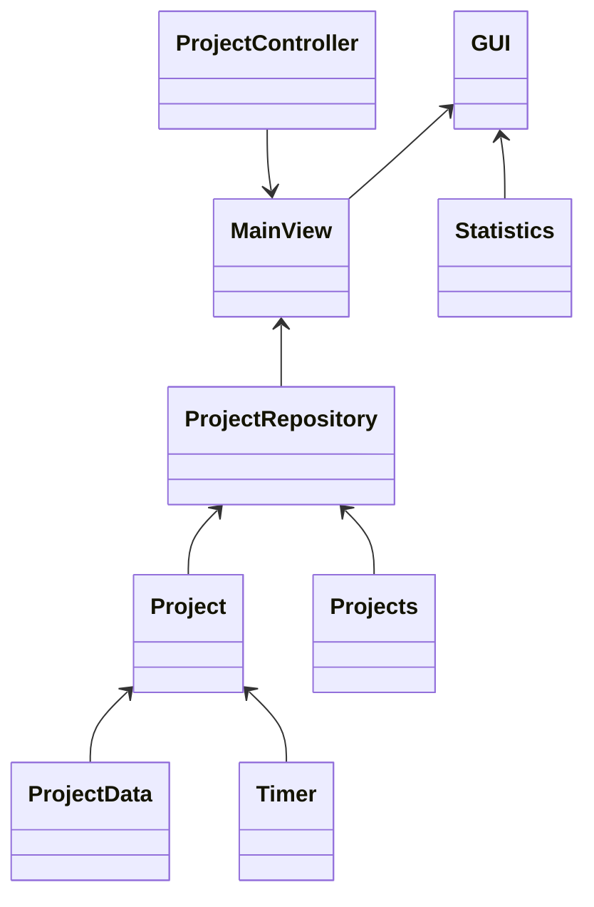

# Arkkitehtuurikuvaus

## Rakenne

Sovellus on jaettu viiteen hakemistoon, joista entities ja repos kuuluvat sovellusjogiikan kerrokseen. Database hakemisto sisältää pysyväistalletukseen tarvittavat itse tietokannan käyttöön liittyvät luokat. Gui hakemistossa on käyttöliittymän toteutus.

## Käyttöliittymä

Sovelluksessa on toistaiseksi vain yksi näkymä. Vasemmalla puolella ovat päällekkäin eri projektit, jotka on haettu tietokannasta. Jokaisella projektilla on ajastimenhallintanapit. Oikealla puolella on uuden projektin lisäämiseen tarvittavat toiminnot.

## Luokkakaavio

