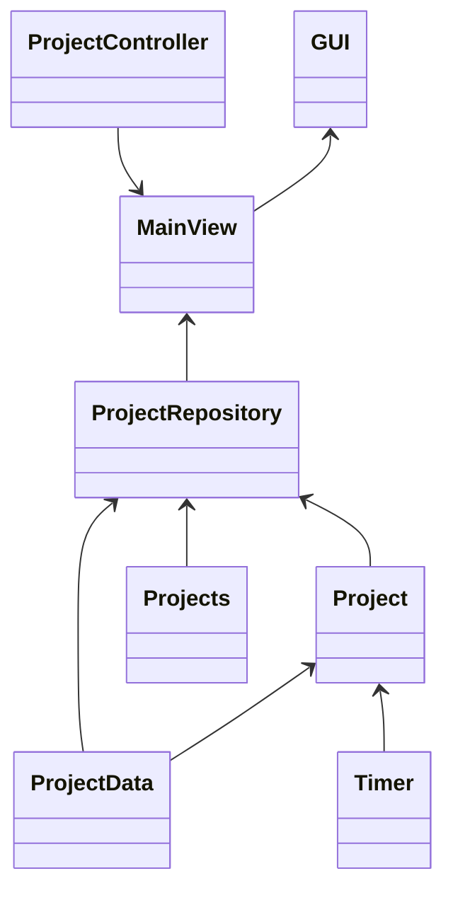

# Arkkitehtuurikuvaus

## Rakenne

Sovellus on jaettu viiteen hakemistoon, joista entities ja repos kuuluvat sovellusjogiikan kerrokseen. Database hakemisto sisältää pysyväistalletukseen tarvittavat itse tietokannan käyttöön liittyvät luokat. Gui hakemistossa on käyttöliittymän toteutus.

## Käyttöliittymä

Sovelluksessa on toistaiseksi vain yksi näkymä. Vasemmalla puolella ovat päällekkäin eri projektit, jotka on haettu tietokannasta. Jokaisella projektilla on ajastimenhallintanapit. Oikealla puolella on uuden projektin lisäämiseen tarvittavat toiminnot.

## Luokkakaavio



## Sekvenssikaavio

Projektin luominen, ajastaminen ja tiedon tallentaminen
```mermaid
sequenceDiagram
    participant käyttäjä
    participant index.py
    participant GUI
    participant ProjectRepo
    participant MainView
    participant Project
    participant Timer
    participant Projects
    participant ProjectData
    participant ProjectController
    index.py ->> GUI: GUI.start()
    GUI ->> MainView: init MainView
    MainView ->> ProjectRepo: get_projects()
    ProjectRepo ->> Projects: select(Projects) [tyhjä]
    käyttäjä ->> MainView: _create_project('ohte')
    MainView ->> ProjectRepo: add_project('ohte')
    ProjectRepo ->> Projects: session.add_all([Projects(name = 'ohte')])
    ProjectRepo ->> Project: self._projects.append(Project('ohte', 1))
    ProjectRepo -->> MainView: True [luonti onnistui]
    MainView ->> ProjectController: ProjectController(self._left_frame, project) [project on aiemmin luotu Project olio]
    käyttäjä ->> ProjectController: self._play()
    ProjectController ->> Timer: self._project.timer.start()
    käyttäjä ->> ProjectController: self._stop()
    ProjectController ->> Project: self._project.save()
    Project ->> Timer: self.timer.stop()
    Timer -->> Project: 20 [sekuntia]
    Project ->> ProjectData: ProjectData(project_id = self.id_, time = time, date = datetime.today())
    käyttäjä ->> MainView: _get_statistics(self._right_frame, '') [tyhjä merkkijono hakee kaiken datan]
    MainView ->> ProjectRepository: get_stats('')
    ProjectRepository ->> ProjectData: select(func.sum(ProjectData.time)).where()ProjectData.project_id == project.id_, ProjectData.date.startswith(timestr))
    ProjectData -->> ProjectRepository: 20
    ProjectRepository -->> MainView: '' Projektien kokonaisajat kaikista\n tallennetuista ajoista:\n\n ohte '00:00:20'
    