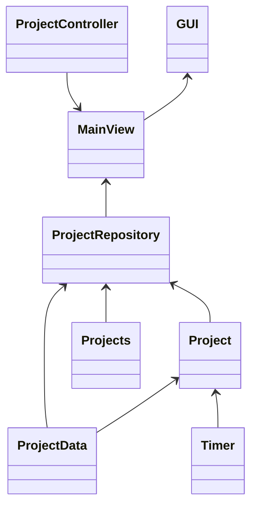
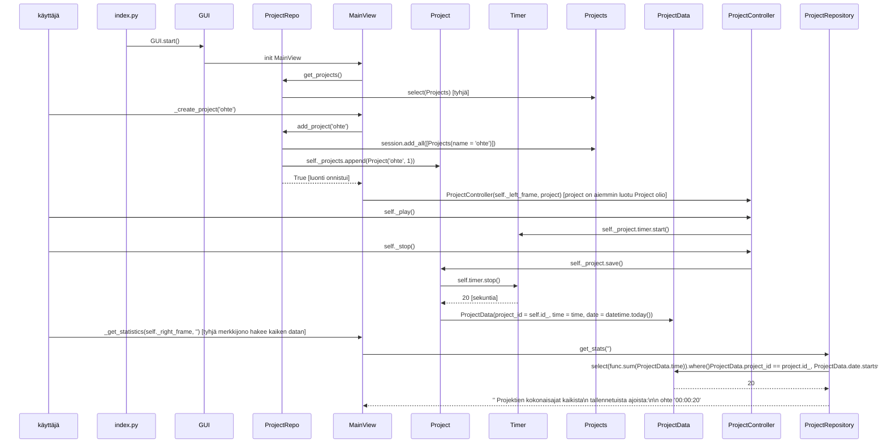

# Arkkitehtuurikuvaus

## Rakenne

Sovellus on jaettu viiteen hakemistoon, joista entities ja repos kuuluvat sovellusjogiikan kerrokseen. Database hakemisto sisältää pysyväistalletukseen tarvittavat itse tietokannan käyttöön liittyvät luokat. Gui hakemistossa on käyttöliittymän toteutus.

## Käyttöliittymä

Sovelluksessa on toistaiseksi vain yksi näkymä. Vasemmalla puolella ovat päällekkäin eri projektit, jotka on haettu tietokannasta. Jokaisella projektilla on ajastimenhallintanapit. Oikealla puolella on uuden projektin lisäämiseen tarvittavat toiminnot.

## Luokkakaavio

Käyttöliittymästä vastaa GUI luokka. Tämä käyttää päänäkymän luovaa MainView-luokkaa. Rakenne mahdollistaa useamman näkymän tekemisen, mutta vain yksi on käytössä. Projektien hallintapalkit ovat oma luokkansa, jota vain MainView käyttää.
ProjectRepository on luokka, joka hoitaa tietokantatallennuksen hallitsemisesta, ja hoitaa tiedon säilytyksen ajon aikana. Ohjelman ajon aikana projektit tallennetaan Project-olioina, joille jokaiselle on luotu oma Timer-olio.
Tietokannan käyttöön ProjectRepository käyttää kahta taulua, jotka on tehty SQLalchemya käyttäen Projects- ja ProjectData luokkina. Projects-tauluun tallennetaan vain projektit. ProjectData-tauluun tallennetaan mitatut ajat, joissa viitataan Projects-taulun id-avaimeen.

## Sekvenssikaavio

Projektin luominen, ajastaminen ja tiedon tallentaminen

index.py tiedoston ajaminen käynnistää sovelluksen. Index käynnistää GUI:n, joka käynnistää päänäkymän. Päänäkymä pyytää ProjectReposta tallennetut projektit. ProjectRepo hakee kaikki tietokannassa olevat projektit, ja tallentaa niistä Project-oliot listaan.
Kun käyttäjä luo uuden projektin, ProjectRepo tarkastaa, onko projektin nimi validi, ja luo uuden projektin. MainView luo uudelle projektille ProjectController-olion projektin hallintaan käyttöliittymällä. Kun ProjectControllerista painaa play-nappia, käynnistetään kyseisen projektin Timer.
Stop-nappi ajaa Timerin stop-metodin. ProjectRepo tallentaa mitatun ajan tietokantaan. Nyt projektidatan hakeminen tyhjällä haulla hakee koko historian tallennetuista ajoista. Statistiikoissa näytetään jokaisen ikinä luodun projektin kokonaisajan.
