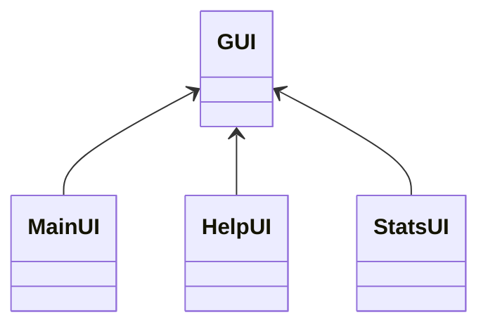

# Luokkakaavio

## Käyttöliittymä



## Sovelluslogiikka

```mermaid
classDiagram
	Timer <-- Stopwatch
	Database <-- Timer
	Piechart <-- Database
	Graph <-- Database
	class Stopwatch{
	}
	class Timer{
	stopwatch
	instance
	}
	Piechart{
	}
	Graph{
	}
	Database{
	}
```