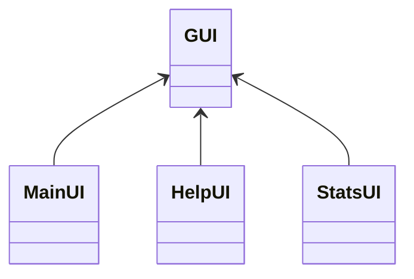
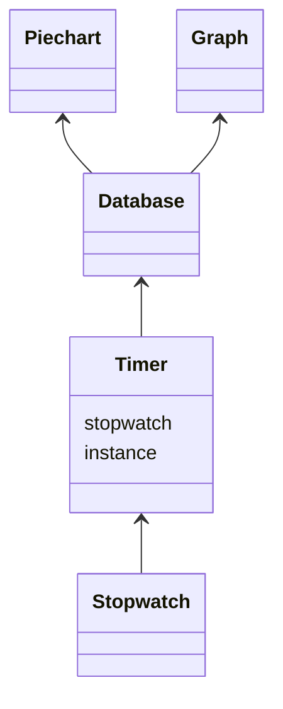

# Luokkakaavio

## Käyttöliittymä

```mermaid
classDiagram
	GUI <-- MainUI
	GUI <-- HelpUI
	GUI <-- StatsUI
	class GUI{
	}
	class MainUI{
	}
	class HelpUI{
	}
	class StatsUI{
	}
```

## Sovelluslogiikka

```mermaid
classDiagram
	Timer <-- Stopwatch
	Database <-- Timer
	Piechart <-- Database
	Graph <-- Database
	class Stopwatch{
	}
	class Timer{
	stopwatch
	instance
	}
	class Piechart{
	}
	class Graph{
	}
	class Database{
	}
```