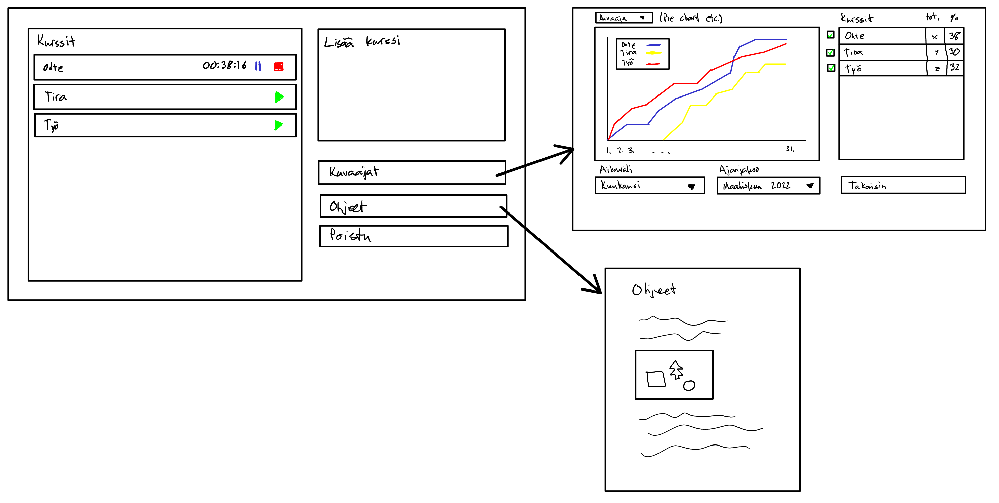

# Vaatimusmäärittely

## Sovelluksen tarkoitus

Sovelluksen avulla käyttäjä pystyy kirjaamaan ja seuraamaan työaikaa opintojen tai töiden parissa. Sovelluksesta pystyy seuraamaan eri aikajaksojen statistiikkoja ja kuvaajia käytetystä ajasta eri kohteisiin.

## Käyttöliittymä

## Perusversion toiminnallisuus

- (valmis) kurssien lisäys
- (valmis) tietojen tallennus sqlite3 tietokantaan
- (valmis) kurssiajan tallentaminen ajastimen perusteella

## Jatkokehitysideoita

- statistiikat ja kuvaajat eri aiheista
- selkeä ja siisti käyttöliittymä
- (valmis) usea ajastin käytössä samaan aikaan
- tietojen exporttaus csv tiedostona
