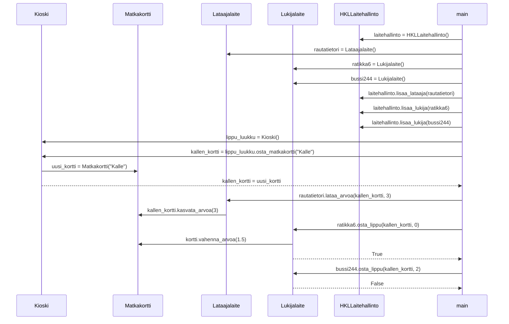

# HSL matkakorttijärjestelmä

## Sekvenssikaavio

```mermaid
sequenceDiagram
    participant Kioski
    participant Matkakortti
    participant Lataajalaite
    participant Lukijalaite
    participant HKLLaitehallinto
    participant main
    main->>HKLLaitehallinto: laitehallinto = HKLLaitehallinto()
    main->>Lataajalaite: rautatietori = Lataajalaite()
    main->>Lukijalaite: ratikka6 = Lukijalaite()
    main->>Lukijalaite: bussi244 = Lukijalaite()
    main->>HKLLaitehallinto: laitehallinto.lisaa_lataaja(rautatietori)
    main->>HKLLaitehallinto: laitehallinto.lisaa_lukija(ratikka6)
    main->>HKLLaitehallinto: laitehallinto.lisaa_lukija(bussi244)
    main->>Kioski: lippu_luukku = Kioski()
    main->>Kioski: kallen_kortti = lippu_luukku.osta_matkakortti("Kalle")
    Kioski->>Matkakortti: uusi_kortti = Matkakortti("Kalle")
    Kioski-->>main: kallen_kortti = uusi_kortti
    main->>Lataajalaite: rautatietori.lataa_arvoa(kallen_kortti, 3)
    Lataajalaite->>Matkakortti: kallen_kortti.kasvata_arvoa(3)
    main->>Lukijalaite: ratikka6.osta_lippu(kallen_kortti, 0)
    Lukijalaite->>Matkakortti: kortti.vahenna_arvoa(1.5)
    Lukijalaite-->>main: True
    main->>Lukijalaite: bussi244.osta_lippu(kallen_kortti, 2)
    Lukijalaite-->>main: False
```