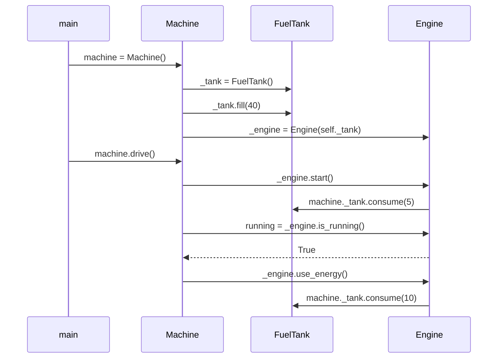

# Machine

## Sequence diagram

```mermaid
sequenceDiagram
    participant main
    participant Machine
    participant FuelTank
    participant Engine

    main->>Machine: machine = Machine()
    Machine->>FuelTank: _tank = FuelTank()
    Machine->>FuelTank: _tank.fill(40)
    Machine->>Engine: _engine = Engine(self._tank)
    main->>Machine: machine.drive()
    Machine->>Engine: _engine.start()
    Engine->>FuelTank: machine._tank.consume(5)
    Machine->>Engine: running = _engine.is_running()
    Engine-->>Machine: True
    Machine->>Engine: _engine.use_energy()
    Engine->>FuelTank: machine._tank.consume(10)
```