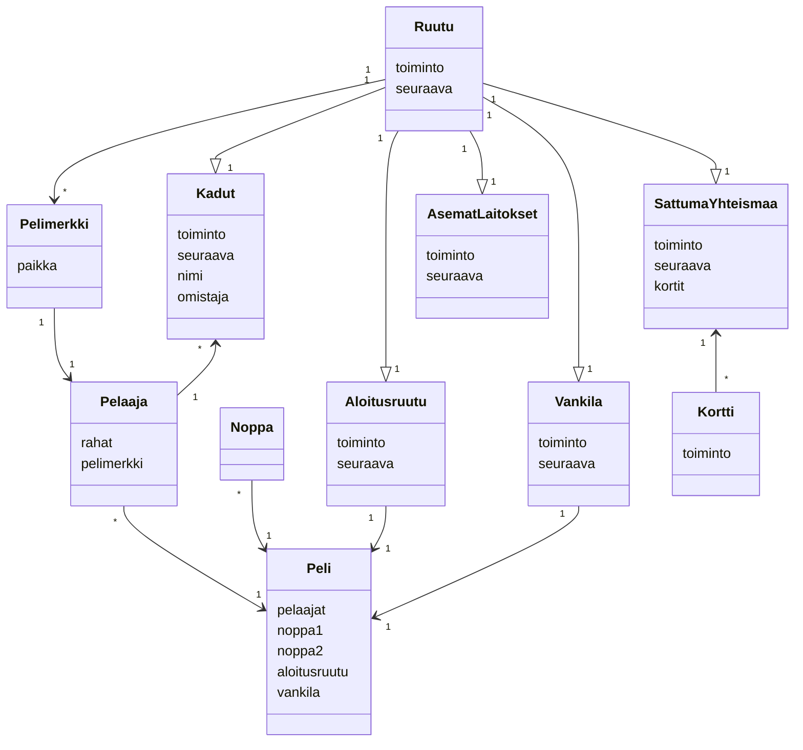

# Monopoli

## Luokkakaavio

Laajennettu versio

```mermaid
classDiagram
	Pelimerkki "1" --> "1" Pelaaja
	Pelaaja "*" --> "1" Peli
	Noppa "*" --> "1" Peli
	Aloitusruutu "1" --> "1" Peli
	Vankila "1" --> "1" Peli
	Ruutu "1" --> "*" Pelimerkki
	Kadut "*" <-- "1" Pelaaja
	Ruutu "1" --|> "1" Aloitusruutu
	Ruutu "1" --|> "1" Vankila
	Ruutu "1" --|> "1" SattumaYhteismaa
	Ruutu "1" --|> "1" AsematLaitokset
	Ruutu "1" --|> "1" Kadut
	SattumaYhteismaa "1" <-- "*" Kortti
	class Pelimerkki{
	    paikka
	}
	class Pelaaja{
	    rahat
		pelimerkki
	}
	class Peli{
	    pelaajat
	    noppa1
	    noppa2
	    aloitusruutu
		vankila
	}
	class Ruutu{
		toiminto
		seuraava
	}
	class Aloitusruutu{
		toiminto
		seuraava
	}
	class Vankila{
		toiminto
		seuraava
	}
	class SattumaYhteismaa{
		toiminto
		seuraava
		kortit
	}
	class Kortti{
		toiminto
	}
	class AsematLaitokset{
		toiminto
		seuraava
	}
	class Kadut{
		toiminto
		seuraava
		nimi
		omistaja
	}
	class Noppa{
	}
```
