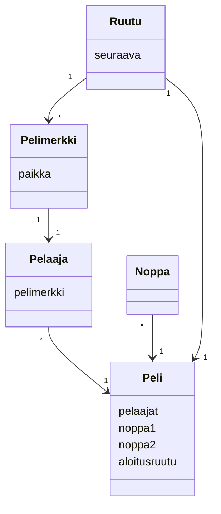

# Monopoli

## Luokkakaavio

```mermaid
classDiagram
	Pelimerkki "1" --> "1" Pelaaja
	Pelaaja "*" --> "1" Peli
	Noppa "*" --> "1" Peli
	Ruutu "1" --> "*" Pelimerkki
    Ruutu "1" --> "1" Peli
	class Pelimerkki{
	    paikka
	}
	class Pelaaja{
		pelimerkki
	}
	class Peli{
	    pelaajat
	    noppa1
	    noppa2
	    aloitusruutu
	}
	class Ruutu{
		seuraava
	}
	class Noppa{
	}
```
